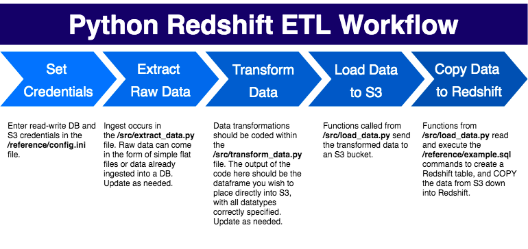

# Python - Redshift ETL



This workflow is intended to provide a quick solution to performing data transformation in python and quickly uploading the transformed dataset into a Redshift database. I created it as the frequent need arose to upload data regularly to Redshift databases via either simple excel files, or via transformations of existing raw data in Redshift. This workflow can be modified to support other database types if possible. Some advantages of this workflow:

* Improve upon the notoriously slow `to_sql` function in Pandas. While `to_sql` is an easy way to create and append data to tables in Redshift, it operates incredibily slowly even with advanced functionality activated (such as setting `method=multi`). This script takes advantage of S3 COPY statements which can bring upload time down from hours to seconds. 

* Leverage pre-written SQL scripts to save time and reduce code redundancy. Oftentimes when creating an ETL pipeline, developers will start out in a database IDE writing SQL to create schema structures, access existing raw data, and grant permissions to users. This is a natural starting point that produces valuable code that ideally could be leveraged as-is in an ETL pipeline (without the need to embed SQL statements individually within Python code).

* Keep credentials managed with best-practices. Usernames, passwords, and connections should never be hardcoded within code itself, but instead should be placed in configuration files as key-value pairs.

* Run jobs on a pre-determined schedule, hassle free. This works best if your python instance lives on a remote server and can therefore take full advantage of Cron scheduling. 

This workflow has proven its use across multiple projects as a quick self-serve method for performing ETL without too much overhead. 

## Getting Started

* Clone the repository:

```bash
git clone https://github.com/mt592/python-redshift-etl.git
```

* Enter read-write credentials to your Redshift database and S3 bucket in **/reference/config.ini**:

* Make changes to **/src/extract_data.py** and **/src/transform_data.py** to fit the needs of your pipeline.

* Run the pipeline:
```bash
python run_pipeline.py "./reference/data_file.csv"
```

